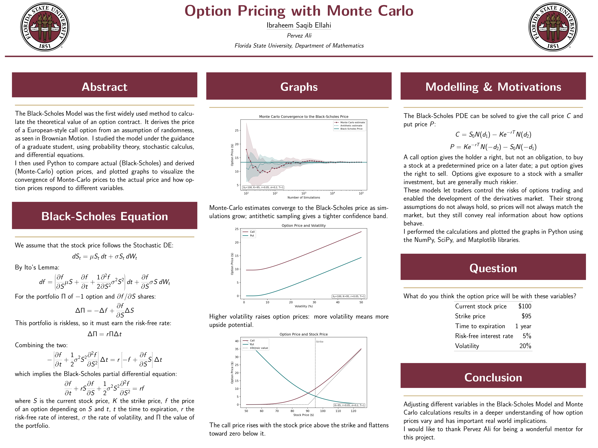
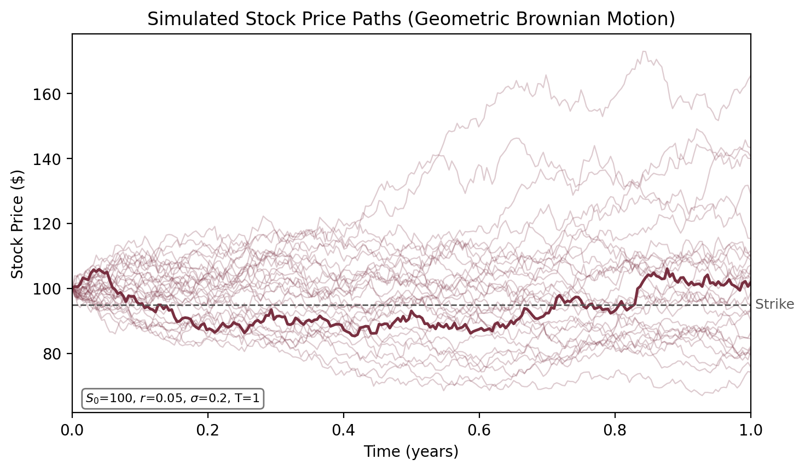
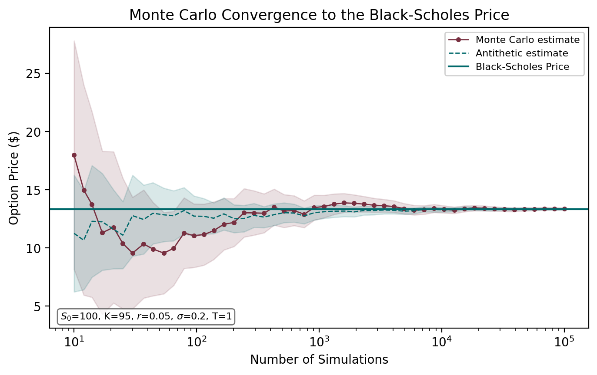
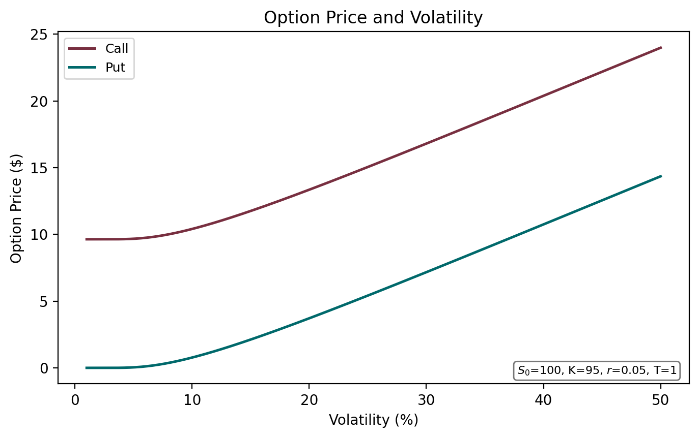
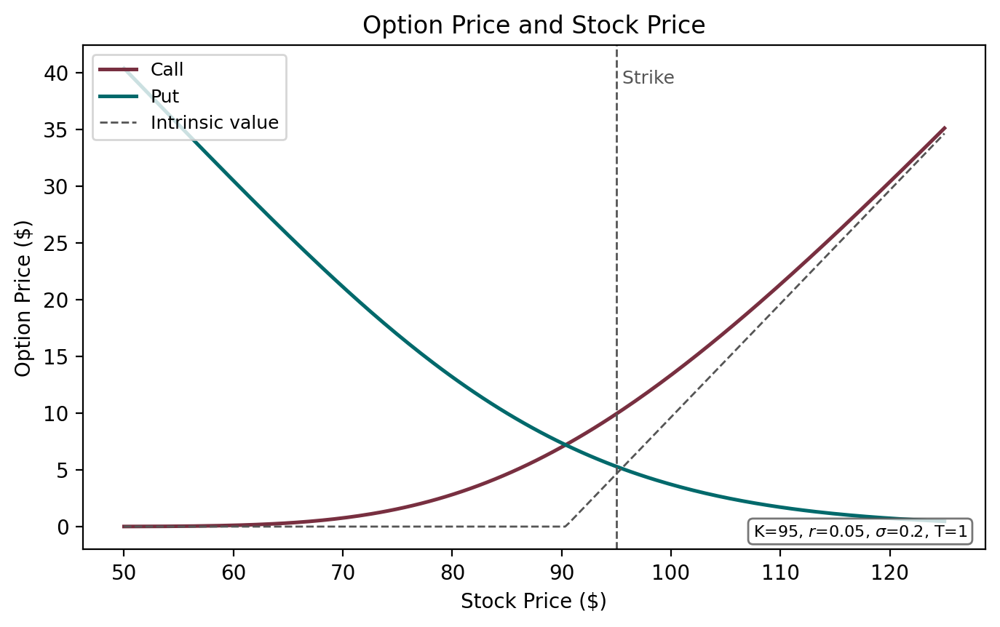

# Option Pricing with Monte Carlo



[Poster PDF](poster/poster.pdf)

I developed this project as part of the Directed Reading Program in Mathematics at Florida State University, Spring 2025. I studied the Black-Scholes Model under the guidance of a graduate mentor, using probability theory, stochastic calculus, and differential equations to derive and understand it. I then implemented the Black-Scholes formula and a Monte Carlo simulation in Python to compare exact and simulated option prices, and used antithetic variates to reduce the variance of the Monte Carlo estimate.

## What's here

`src/` has the three scripts: `black_scholes.py` for the closed-form call, put, and Greeks; `monte_carlo.py` for the simulation, with and without antithetic variates; and `make_figures.py`, which generates everything in `figures/`. `poster/` has the LaTeX source and PDF/PNG of the poster I presented at the end of the program.

## The model

The stock price is assumed to follow Geometric Brownian Motion:

$$dS_t = \mu S_t\,dt + \sigma S_t\,dW_t$$

Applying Ito's Lemma and a no-arbitrage argument to an option written on this stock gives the Black-Scholes partial differential equation, which has a closed-form solution for European calls and puts:

$$C = S_0 N(d_1) - K e^{-rT} N(d_2)$$
$$P = K e^{-rT} N(-d_2) - S_0 N(-d_1)$$

The Monte Carlo approach instead simulates many terminal stock prices under the same GBM assumption, averages the discounted payoffs, and lets the law of large numbers do the rest. It's slower and noisier than the closed form, but it extends to payoffs that don't have one.

## Results



Simulated stock price paths under Geometric Brownian Motion, starting at $100. One path is highlighted against the strike price of $95 to show how a single trajectory can end up above or below it by expiration.



Monte Carlo call price estimates converge to the Black-Scholes price as the number of simulations grows. The antithetic estimate lands closer to the true price with a tighter confidence band at low simulation counts, which is the point of using it.



Higher volatility raises both call and put prices, because more volatility means more upside for the holder without any added downside beyond losing the premium.



Call value rises with the stock price and put value falls, each approaching its intrinsic value as the option moves further in the money.

## Running it

Install the requirements, then run the scripts in order:

```
pip install -r requirements.txt
python src/black_scholes.py
python src/monte_carlo.py
python src/make_figures.py
```

Thanks to Pervez Ali for mentoring this project through the FSU Math DRP.
